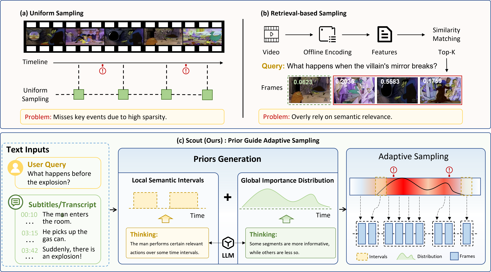
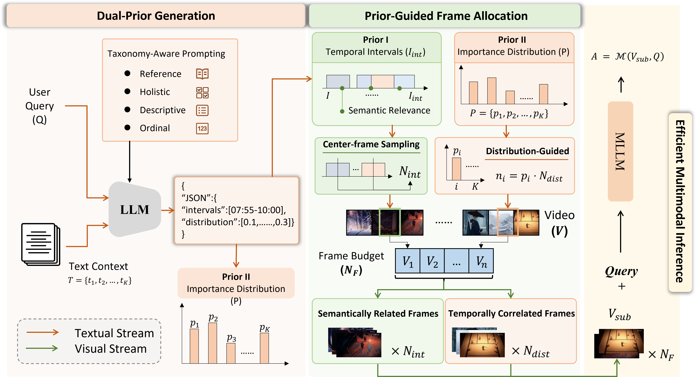

# Scout: Prior-Guided Adaptive Sampling for Efficient Long Video Understanding

<!-- > **ICCV 2025** | First agent framework that outperforms GPT-4o and all SOTA models in long video understanding tasks -->


## 🎯 Overview

**Scout** is a training-free, prior-guided adaptive sampling framework for long video understanding. It leverages auxiliary text inputs (subtitles or transcriptions) to generate temporal priors via LLM reasoning, directing the frame budget toward the most query-relevant regions of the video — without any visual preprocessing.

<p align="center">
  
</p>

### Why Scout? 💬

| Method | Limitation |
|---|---|
| Uniform Sampling | Misses key events due to fixed temporal intervals |
| Retrieval-based Sampling | Requires costly offline visual encoding; prone to static alignment bias |
| **Scout (Ours)** | Text-driven prior generation; no visual preprocessing; robust across video lengths |

---

## 🏗️ Method

Scout operates in two main stages:

**1. Dual-Prior Generation** 👁️

Given the user query $Q$ and text stream $T$ (subtitles or transcriptions), an LLM classifies the query into one of four types (Reference / Holistic / Descriptive / Ordinal) via taxonomy-aware prompting and produces:

- **Prior I**: Fine-grained temporal intervals (e.g., `[00:03:33–00:04:44]`) that localize semantically relevant segments
- **Prior II**: A global importance distribution $P = \{p_1, \dots, p_K\}$ that captures temporal density across the entire video

**2. Prior-Guided Frame Allocation** 🔄

- **Stage 1 (Interval-guided)**: Extract representative frames from Prior I intervals to form a semantic anchor set $I_{int}$
- **Stage 2 (Distribution-guided)**: Distribute the remaining frame budget proportionally according to $P$ to form $I_{dist}$

The final visual sequence $V_{sub}$ is passed to the MLLM together with $Q$ for answer generation.

<p align="center">
  
</p>

---

## 📊 Results

### ✅ Main Results

Scout improves Qwen2.5-VL-7B over the uniform sampling baseline by large margins, while using as few as **20 frames**:

| Benchmark | Baseline | Scout | Gain |
|---|---|---|---|
| LVBench | 34.93% | 45.05% | **+10.12%** |
| LongVideoBench | 54.82% | 58.36% | **+3.54%** |
| Video-MME (Long) | 48.67% | 53.67% | **+5.00%** |

Despite using a 7B backbone, Scout (50.28% on LVBench) outperforms InternVL2.5-78B (43.60%) and Qwen2.5-VL-72B (47.7%).

<!-- ### Frame Efficiency

Scout achieves comparable accuracy to the baseline at **one-quarter to one-half** of the frame budget, translating to a **25%–75% reduction** in frame-level computational cost.

| Frames | Baseline (LongVideoBench) | Scout (LongVideoBench) |
|---|---|---|
| 20 | 54.82% | 58.36% |
| 100 | — | 62.10% |
| 400 | 62.13% | — | -->

### ✅ Robustness to Video Duration

Scout delivers consistent accuracy gains across all video duration ranges (0–60+ minutes), with the advantage growing for very long videos, achieving a peak gain of **+12.47%** for videos exceeding one hour.

---

## 🚀 Installation

### Prerequisites
- Python 3.12+
- CUDA 12.0+ (recommended for GPU acceleration)
- 100GB+ disk space (for models and datasets)

### Setup

```bash
# Create conda environment
conda create -n lvagent python=3.12
conda activate lvagent

# Install dependencies
pip install -r requirements.txt
```

## 📥 Data & Model Preparation

### 1. Download Datasets
Download from Hugging Face:
- **LongVideoBench** - Long video QA dataset
- **VideoMME** - Multi-modal video understanding
- **LVBench** - Extra long video understanding

```bash
# Example using huggingface-cli
hf download <dataset-repo> --repo-type dataset --local-dir ./datasets/
```

### 2. Download Models
Download from Hugging Face Model Hub:

| Model | Size | Purpose |
|-------|------|---------|
| Qwen2.5-VL | 7B | Vision-language understanding |


```bash
# Example model download
hf download Qwen/Qwen2.5-VL-7B-Instruct --local-dir ./models/
```

<!-- ### 3. Configure Paths
Update dataset and model paths in key files:

**Files to modify** (search for `/fs-computility`):
- `discuss_final_lvbench.py`
- `all_model_agent.py`
- `all_model_util.py` -->

<!-- Replace all occurrences of `/fs-computility/` with your local paths: -->

<!-- ```python
# Before
MODEL_PATH = "/fs-computility/models/Qwen2.5-VL-72B"

# After
MODEL_PATH = "/path/to/your/models/Qwen2.5-VL-72B"
``` -->


## 🔧 Usage

### Basic Inference

Run inference on a single video:

```bash
# set 'video_root, subtitle_root, json_path, bench_name' to your own path
python self-agent.py
```

<!-- ### Evaluate on Benchmarks

#### LongVideoBench Evaluation
```bash
python DataProcessing/discuss_final_lvbench.py \
    --dataset_path ./datasets/LongVideoBench \
    --output_dir ./results/ \
    --num_agents 3
```

#### VideoMMe Evaluation
```bash
python DataProcessing/eval_videomme.py \
    --dataset_path ./datasets/VideoMMe \
    --batch_size 4
```

### Advanced Configuration

Edit agent composition in `all_model_agent.py`:

```python
from all_model_agent import Qwen2_5_Agent, InternVLAgent, LLaVAAgent

# Define agent team
agents = [
    Qwen2_5_Agent(model_size="72B"),
    InternVLAgent(model_size="26B"),
    LLaVAAgent(model_size="72B")
]

# Configure reflection strategy
from self_agent import SelfAgent
coordinator = SelfAgent(agents=agents, reflection_rounds=3)
```

### Subtitle Enhancement

Process video subtitles before QA:

```bash
python subtitle_rebuild.py --video_path ./video.mp4 --output_srt ./enhanced.srt
python subtitle_stitching.py --srt_files ./segment1.srt ./segment2.srt \
    --output_srt ./merged.srt
```

## 🧠 Supported Models & Agents

| Agent Type | Model | Size | GPU Memory | Notes |
|-----------|-------|------|-----------|-------|
| **Qwen2.5-VL** | Qwen/Qwen2.5-VL | 7B, 72B | 16GB, 80GB | Best overall performance |
| **Qwen2-VL** | Qwen/Qwen2-VL | 7B, 72B | 16GB, 80GB | Earlier version, reliable |
| **InternVL** | OpenGVLab/InternVL | 8B, 26B, 78B | 8GB, 48GB, 80GB | Strong cross-modal understanding |
| **LongVU** | ThreeSigma/LongVU | - | - | Specialized for long videos |
| **LLaVA-Video** | LMSYS/LLaVA-Video | 72B | 80GB | Video-optimized LLaVA variant |

### Agent Selection Strategy

- **Complex reasoning**: Use larger models (72B)
- **Fast inference**: Mix of 7B/26B models
- **Balanced**: Combination of 2-3 different architectures
- **Long videos**: Include LongVU for temporal context

## 📊 Datasets Supported

| Dataset | Task | Videos | Questions | Language |
|---------|------|--------|-----------|----------|
| **LongVideoBench** | Long-form QA | - | - | English |
| **VideoMMe** | Multi-modal understanding | - | - | English |
| **EgoSchema** | Egocentric understanding | - | - | English |
| **MLVU** | Multi-lingual QA | - | - | Multi-lingual | -->

<!-- ## 🎓 Citation

If you use LVAgent in your research, please cite:

```bibtex
@inproceedings{lvagent2025,
  title={LVAgent: Dynamic Multi-Agent Collaboration for Long Video Understanding},
  booktitle={International Conference on Computer Vision (ICCV)},
  year={2025}
} 
```-->

## 📝 Configuration

### Environment Variables

```bash
# API Configuration
export NVIDIA_API_KEY="your_nvidia_key"  # For NVIDIA endpoints
export OPENAI_API_KEY="your_openai_key"  # For OpenAI API

# GPU Configuration
export CUDA_VISIBLE_DEVICES="0,1,2,3"  # Multi-GPU setup
```

### Key Hyperparameters 🛠️

Edit in `self-agent.py`:

```python
# different modes
num_samples = None  # Set to an integer for testing a subset
distribution_mode = 2 # 0: uniform sampling, 1: distributional sampling with q, 2: distributional sampling with subtitles
subtitle_mode = 1 # 0:no subtitles, 1:distribution with subtitles, 2:answering with subtitles
Nf = 20 # frame budget
```

## 📁 Project Structure

```
Scout/
├── README.md
├── requirements.txt
│
├── Core Agent System
├── all_model_agent.py          # MLLM wrapper classes & agent definitions
├── all_model_util.py           # Utility functions for video/image processing
├── self-agent.py               # SelfAgent implementation with API integration
├── priori_infer.py             # Main inference script
│
├── Question Processing
├── QuesGrouding/
│   ├── QuesClassifier.py       # LLM-based question classification
│   ├── QuesPrompt.py           # Prompt templates for different question types
│   ├── QuestionDistributor.py  # Route questions to appropriate agents
│   └── utils.py
│
├── Subtitle Processing
├── subtitle_rebuild.py         # Parse & semantically reorganize subtitles
├── subtitle_stitching.py       # Merge and unify subtitle formatting
│
├── Vision-Language Models
├── llava/                      # LLaVA model implementation
├── internvl_chat/              # InternVL model implementation
├── CLIP4Clip/                  # Cross-modal retrieval module
│   ├── eval_model.py
│   ├── modules/                # CLIP modules
│   ├── dataloaders/            # Video dataloader utilities
│   └── metrics.py
│
├── Data Processing
├── DataProcessing/
│   ├── discuss_final_lvbench.py        # LongVideoBench evaluation
│   ├── check_cache.py                  # Cache validation
│   ├── collect_dis.py                  # Collect statistics
│   ├── stat_vmme_level_accuracy.py     # Accuracy analysis
│   └── ...
│
├── Segmentation & Utilities
├── segmentation/               # Video segmentation models
├── modules/                    # Shared model modules
└── streamlit_demo/            # Interactive web interface (optional)
```


<!-- ## Citation

```bash
@article{chen2025lvagent,
  title={Lvagent: Long video understanding by multi-round dynamical collaboration of mllm agents,
  author={Chen, Boyu and Yue, Zhengrong and Chen, Siran and Wang, Zikang and Liu, Yang and Li, Peng and Wang, Yali,
  journal={arXiv preprint arXiv:2503.10200,
  year={2025


@article{wang2025videochat,
  title={VideoChat-A1: Thinking with Long Videos by Chain-of-Shot Reasoning,
  author={Wang, Zikang and Chen, Boyu and Yue, Zhengrong and Wang, Yi and Qiao, Yu and Wang, Limin and Wang, Yali,
  journal={arXiv preprint arXiv:2506.06097,
  year={2025

``` -->

